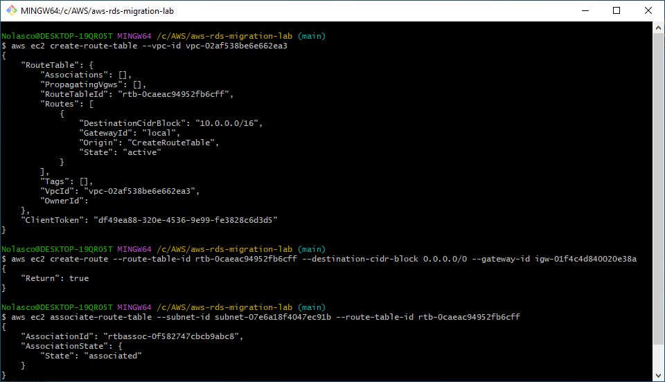

# AWS RDS Migration Lab
---

## Overview

- Migrate a MariaDB database from an EC2 instance to a Single-AZ RDS MariaDB with AWS DMS.
- Migration is monitored via CloudWatch.

---
⚠️ Attention:

- All the tasks will be completed via the command line using AWS CLI. Ensure you have the necessary permissions. [Install AWS CLI](https://docs.aws.amazon.com/cli/latest/userguide/getting-started-install.html)
- Charges may apply for completing this lab. [AWS Pricing](https://aws.amazon.com/pricing/)
---

# *Part I: Set Up Origin Database Environment*

---

## Step 1: Create a VPC and Subnets
#### 1.1. Create a VPC
Create a VPC that will be used to host the EC2 instance and RDS.
  - Replace `<cidr-block>` with the CIDR block you wish to use (e.g., 10.0.0.0/16).
```bash
aws ec2 create-vpc --cidr-block <cidr-block>
```

<div align="center">
  
</div>

#### 1.2. Create Subnets
Create subnets for the EC2 instance and RDS. One public subnet for EC2 and two private subnets for RDS, one in a different AZ.
  - Replace `<vpc-id>` with the ID of the VPC created in the previous step.
  - Replace `<cidr-block>` with the desired CIDR block for each subnet (e.g., 10.0.1.0/24 for EC2 and 10.0.2.0/24 and 10.0.3.0/24 for RDS).
  - Replace `<az-name>`with the name of the availability zone where you want to create your resources (e.g., us-east-1a or us-east-1b)
  - Replace `<az-name-different>` with a different availability zone for the second private subnet for RDS.

#### Public Subnet for EC2:
```bash
aws ec2 create-subnet --vpc-id <vpc-id> --cidr-block <cidr-block> --availability-zone <az-name>
```

<div align="center">
  
</div>

#### First Private Subnet for RDS (same AZ as public):
```bash
aws ec2 create-subnet --vpc-id <vpc-id> --cidr-block <cidr-block> --availability-zone <az-name>
```

<div align="center">
  
</div>

#### Second Private Subnet for RDS (different AZ):
```bash
aws ec2 create-subnet --vpc-id <vpc-id> --cidr-block <cidr-block> --availability-zone <az-name-different>
```

<div align="center">
  
</div>

#### 1.3. Set up an Internet Gateway
Attach an Internet Gateway to the VPC to allow the EC2 instance to access the internet.
  - Replace `<vpc-id>` for your VPC ID.
  - Replace `<gateway-id>` with your Internet Gateway ID.
```bash
aws ec2 create-internet-gateway

aws ec2 attach-internet-gateway --vpc-id <vpc-id> --internet-gateway-id <gateway-id>
```

<div align="center">
  
</div>

#### 1.4. Create and Associate a Route Table
Create a route table for the public subnet and associate it with the Internet Gateway.
  - Replace `<vpc-id>` for your VPC ID.
  - Replace `<public-subnet-id>` with your public subnet ID.
  - Replace `<route-table-id>` with your route table ID.
```bash
aws ec2 create-route-table --vpc-id <vpc-id>

aws ec2 create-route \
  --route-table-id <route-table-id> --destination-cidr-block 0.0.0.0/0 --gateway-id <gateway-id>

aws ec2 associate-route-table --subnet-id <public-subnet-id> --route-table-id <route-table-id>
```

<div align="center">
  
</div>

---

## Step 2: Configure the EC2 Instance Simulating On-Premise
#### 2.1. Create a Security Group
Create a security group that allows traffic for MariaDB and SSH access.
  - Replace `<sg-name>` for your security group name.
  - Replace `SG-EC2` for your security group description.
  - Replace `<vpc-id>` for your VPC ID.
```bash
aws ec2 create-security-group \
  --group-name <sg-name> \
  --description "SG-EC2" \
  --vpc-id <vpc-id>
```

<div align="center">
  
</div>

#### 2.2. Add Rules to Security Group
Allow inbound SSH (port 22) and MariaDB (port 3306) traffic.
  - Replace `<sg-ec2-id>`for your EC2 Security Group ID.
```bash
aws ec2 authorize-security-group-ingress \
  --group-id <sg-ec2-id> \
  --protocol tcp \
  --port 22 \
  --cidr 0.0.0.0/0

aws ec2 authorize-security-group-ingress \
  --group-id <sg-ec2-id> \
  --protocol tcp \
  --port 3306 \
  --cidr 0.0.0.0/0
```

<div align="center">
  
</div>

#### 2.3. Create a Key Pair
Before launching the EC2 instance create a key pair that you will use to access the instance.
  - Replace YourKeyPairName with the desired name for your key pair.
```bash
aws ec2 create-key-pair --key-name YourKeyPairName --query 'KeyMaterial' --output text > YourKeyPairName.pem
chmod 400 YourKeyPairName.pem
```

<div align="center">
  
</div>

#### 2.4. Launch EC2 Instance
Simulate an on-premise environment running MariaDB.
  - Replace `<ami-id>` for your AMI ID (e.g., ami-0ebfd941bbafe70c6). [Find an AMI](https://docs.aws.amazon.com/AWSEC2/latest/UserGuide/finding-an-ami.html)
  - Replace `<instance-type>` with your desired instance type (e.g., t2.micro).
  - Replace `<security-group-id>` for your security group ID.one).
  - Replace `<subnet-id>` for your public subnet ID.
```bash
aws ec2 run-instances \
  --image-id <ami-id> \
  --instance-type t2.micro \
  --key-name YourKeyPairName \
  --security-group-ids <security-group-id> \
  --associate-public-ip-address \
  --subnet-id <subnet-id> 
```

<div align="center">
  
</div>

#### 2.5. Connect to EC2 via SSH
Retrieve the Public IPv4 Address of EC2 Instance:
  - Replace `<instance-id>` with your EC2 instance ID.
```bash
aws ec2 describe-instances \
  --instance-ids <instance-id> \
  --query "Reservations[*].Instances[*].PublicIpAddress" \
  --output text
```

<div align="center">
  
</div>

SSH into the EC2 instance to configure MariaDB.
  - Replace `<Public-IP-of-instance>` for the public IP of your EC2 instance.
```bash
ssh -i YourKeyPairName.pem ec2-user@<Public-IP-of-instance>
```

#### 2.6. Install MariaDB
Install and configure MariaDB on the EC2 instance.
```bash
sudo yum update -y
sudo yum install mariadb105-server -y
sudo systemctl start mariadb
sudo systemctl enable mariadb
sudo systemctl status mariadb
```

<div align="center">
  
</div>

<div align="center">
  
</div>

<div align="center">
  
</div>

### 2.7. Create and Populate the Source Database
Download and import the SQL file which is a free sample database from the [Chinook Database](https://github.com/lerocha/chinook-database) repository to populate the source database.
```bash
# Download the Chinook_Db2.sql file
wget https://github.com/lerocha/chinook-database/releases/download/v1.4.5/Chinook_MySql.sql

# Import the Chinook_MySql.sql file directly into MariaDB
sudo mysql -u root -p
source Chinook_MySql.sql
```

<div align="center">
  
</div>

<div align="center">
  
</div>

<div align="center">
  
</div>

#### 2.8. Verify the Import
To confirm that the sample database has been correctly imported.
```bash
# Check if the tables were imported correctly
sudo mysql -u root -p -e "SHOW DATABASES;"

# Once you know the database name you can check its tables
sudo mysql -u root -p -e "USE Chinook; SHOW TABLES;"
```

<div align="center">
  
</div>

---

# *Part II: Database Migration (IN PROGRESS)*

---

## Step 3: Create RDS MariaDB Instance
#### 3.1. Create a Subnet Group
Create a subnet group for RDS that includes the two private subnets.
  - Replace `<db-subnet-group-name>` with your desired subnet group name.
  - Replace `<subnet-id-1>` and `<subnet-id-2`> with the IDs of your two private subnets.
 ```bash
aws rds create-db-subnet-group \
  --db-subnet-group-name <db-subnet-group-name> \
  --db-subnet-group-description "Subnet group for RDS" \
  --subnet-ids <subnet-id-1> <subnet-id-2>
```

#### 3.2. Create a Security Group for RDS
Create a security group that allows MariaDB traffic to the RDS instance.
  - Replace `<sg-name>` with your security group name.
  - Replace `SG-RDS` with your security group description.
  - Replace `<vpc-id>` with your VPC ID.
```bash
aws ec2 create-security-group \
  --group-name <sg-name> \
  --description "SG-RDS" \
  --vpc-id <vpc-id>
```

#### 3.3. Add Rules to Security Group
Allow inbound SSH (port 22) and MariaDB (port 3306) traffic.
  - Replace `<rds-security-group-id>` for your RDS Security group ID.
  - Replace `<sg-ec2-id>`for your EC2 Security Group ID.
```bash
aws ec2 authorize-security-group-ingress \
  --group-id <rds-security-group-id> \
  --protocol tcp \
  --port 22 \
  --cidr 0.0.0.0/0

aws ec2 authorize-security-group-ingress \
  --group-id <sg-rds-id> \
  --protocol tcp \
  --port 3306 \
  --source-group <sg-ec2-id>
```

#### 3.4. Launch RDS MariaDB Instance
Create an RDS MariaDB instance which will serve as the destination for the migration.
  - Replace `<db-instance-identifier>` with your desired RDS instance identifier.
  - Replace `<az_name>` with the same availability zone as your EC2 instance.
  - Replace `<sb-group-name>` with the name of your DB subnet group.
  - Replace `<sg-id>` with your VPC security group ID.
  - Replace `root` with your master username.
  - Replace `adminpassword` with your master password.
```bash
aws rds create-db-instance \
  --db-instance-identifier <db-instance-identifier> \
  --engine mariadb \
  --engine-version 10.11.9 \
  --db-instance-class db.t3.micro \
  --allocated-storage 20 \
  --availability-zone <az_name> \
  --db-subnet-group-name <sb_group_name> \
  --vpc-security-group-ids <sg-id> \
  --no-publicly-accessible \
  --master-username root --master-user-password adminpassword
```

#### 3.5. Retrieve and Record the RDS Endpoint
After creating the RDS instance retrieve and note the RDS endpoint address for use in the migration process.
- Replace `<db-instance-identifier>` with your RDS instance identifier.
```bash
aws rds describe-db-instances --db-instance-identifier <db-instance-identifier> --query "DBInstances[*].[Endpoint.Address]" --output text
```
---

## Step 4: Set Up AWS DMS
#### 4.1. Create the Source Endpoint (MariaDB)
Define the source database (MariaDB running on EC2).
  - Replace `<endpoint-identifier>` with your source DMS endpoint identifier.
  - Replace `<admin>` for your MariaDB username.
  - Replace `<password>` for your MariaDB password.
  - Replace `<EC2-IP>` for the IP of your EC2 instance.
```bash
aws dms create-endpoint \
  --endpoint-identifier <endpoint-identifier> \
  --endpoint-type source \
  --engine-name mariadb \
  --username <admin> \
  --password <adminpassword> \
  --server-name <EC2-IP> \
  --port 3306 \
  --database-name Chinook
```

#### 4.2. Create the Target Endpoint (RDS MariaDB)
Define the target database (RDS MariaDB).
  - Replace `<endpoint-identifier>` with your target DMS endpoint identifier.
  - Replace `<admin>` for your RDS username.
  - Replace `<adminpassword>` for your RDS password.
  - Replace `<RDS-Endpoint>` for your RDS endpoint.
```bash
aws dms create-endpoint \
  --endpoint-identifier rds-endpoint \
  --endpoint-type target \
  --engine-name mariadb \
  --username admin \
  --password adminpassword \
  --server-name <RDS-Endpoint> \
  --port 3306 \
  --database-name ChinookMigrated
```

#### 4.3. Create a DMS Replication Instance
Create a replication instance for DMS, which will handle the data migration.
  - Replace `<dms-instance-identifier>` with your desired DMS instance identifier.
  - Replace `<security-group-id>` for your security group ID.
```bash
aws dms create-replication-instance \
  --replication-instance-identifier <dms-instance-identifier> \
  --replication-instance-class dms.t2.micro \
  --allocated-storage 50 \
  --vpc-security-group-ids <security-group-id>
```

#### 4.4. Create and Start the Migration Task
Create and start the migration task that transfers data from MariaDB to RDS MariaDB.
  - Replace `<source-endpoint-arn>` with the ARN of your source MariaDB endpoint.
  - Replace `<target-endpoint-arn>` with the ARN of your target RDS MariaDB endpoint.
```bash
aws dms create-replication-task \
  --replication-task-identifier migration-mariadb-to-rds \
  --source-endpoint-arn <source-endpoint-arn> \
  --target-endpoint-arn <target-endpoint-arn> \
  --migration-type full-load \
  --table-mappings file://table-mappings.json \
  --replication-task-settings file://task-settings.json
```
#### Content of table-mappings.json:
```json
{
  "rules": [
    {
      "rule-type": "selection",
      "rule-id": "1",
      "rule-action": "include",
      "filters": [],
      "source": {
        "schema": "%",
        "table": "%"
      }
    }
  ]
}
```
#### Content of task-settings.json:
```json
{
  "TargetMetadata": {
    "TargetSchema": "",
    "SupportLobs": true,
    "FullLobMode": false,
    "LobChunkSize": 64,
    "LimitedSizeLobMode": false,
    "LobMaxSize": 0
  },
  "Logging": {
    "EnableLogging": true,
    "LogComponents": [
      {
        "Id": "SOURCE_UNLOAD",
        "Severity": "LOGGER_SEVERITY_DEFAULT"
      },
      {
        "Id": "TARGET_LOAD",
        "Severity": "LOGGER_SEVERITY_DEFAULT"
      }
    ]
  }
}
```

---

## Step 5: Monitor the Migration with CloudWatch
#### 5.1. Check DMS Logs in CloudWatch
Monitor the migration process using CloudWatch logs.
  - Replace `<log-group-name>` with the name of your CloudWatch log group associated with the DMS migration task.
  - Replace `<log-stream>` for your log stream name.
```bash
aws logs describe-log-groups

aws logs get-log-events \
  --log-group-name <log-group-name> \
  --log-stream-name <log-stream-name>
```

---

## Step 6: Verify the Migrated Database
#### 6.1. Connect to RDS and Verify Data
Connect to the RDS MariaDB instance and verify that the data was successfully migrated.
  - Replace `<RDS-Endpoint>` for your RDS endpoint.
```bash
mysql -h <RDS-Endpoint> -u admin -p
SHOW DATABASES;
USE ChinookMigrated;
SHOW TABLES;
```

---

## Step 7: Clean Up Resources
#### 7.1. Remove the resources
Once the lab is completed remove the resources to avoid unnecessary charges.
  - Replace `<instance-id>`, `<db-instance-identifier>`, `<vpc-id>` and `<replication-instance-arn>` with your values.
```bash
aws ec2 terminate-instances --instance-ids <instance-id>

aws rds delete-db-instance \
  --db-instance-identifier <db-instance-identifier> --skip-final-snapshot

aws ec2 delete-vpc --vpc-id <vpc-id>

aws dms delete-replication-instance --replication-instance-arn <replication-instance-arn>
```
